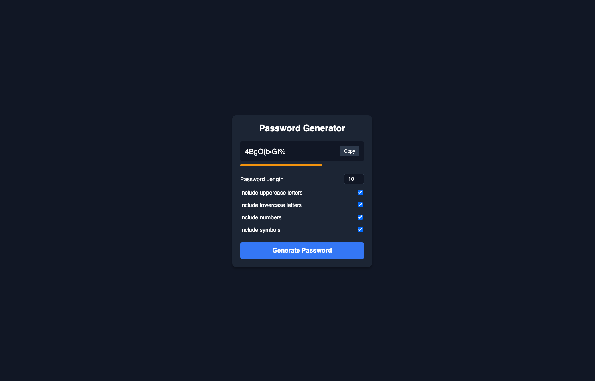

# Password Generator

A simple, secure, and modern password generator built with HTML, CSS, and JavaScript.

## Features

- Generate passwords with customizable lengths (4-20 characters).
- Option to include uppercase letters, lowercase letters, numbers, and symbols.
- One-click copy to clipboard with status feedback.
- Real-time password strength indicator.

## Installation & Running Locally

1. Clone the repository:
git clone https://github.com/ogurchick411/password-generator.git

2. Navigate to the project directory:
cd password-generator

3. Open index.html in your browser or run it using a local server:
- Using Node.js (serve):
npx serve

## Technologies Used

- HTML5
- CSS3
- Vanilla JavaScript

## Preview

## License

This project is open source and available under the MIT License
